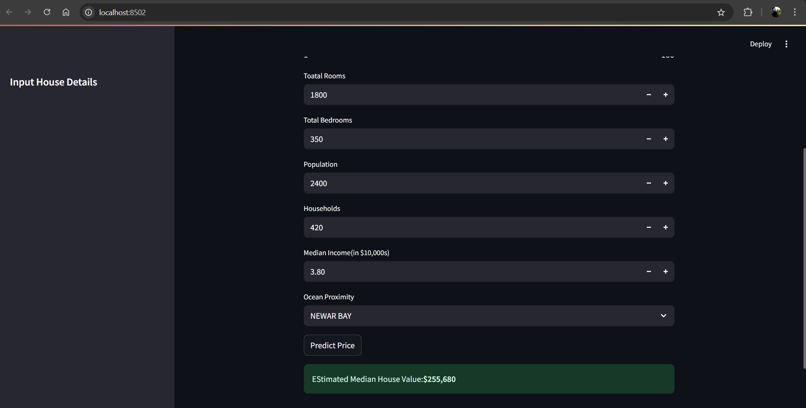

#  House Price Predictor

A beginner-friendly machine learning web app that predicts the **median house value** in California based on basic housing features using a trained model and **Streamlit** for UI.

---

#  Dataset

- **Source:** California Housing Dataset (`housing.csv`)
- **Features used:**
  - Total Rooms
  - Total Bedrooms
  - Population
  - Households
  - Median Income
  - Ocean Proximity (categorical)

---

#  Model

- **Algorithm:** Random Forest Regressor
- **Training Sample:** 5,000 random samples from the dataset
- **Preprocessing:**
  - Missing value handling
  - One-hot encoding for categorical column (`ocean_proximity`)
  - Feature scaling not required for tree-based models

---

#  Tools & Libraries

- Python 3.13
- pandas
- scikit-learn
- joblib
- streamlit

---

#  How to Run

1. Clone this repository
git clone https://github.com/Anshuman1982/house-price-predictor.git
cd house-price-predictor

2. Install dependencies

pip install -r requirements.txt
pip install pandas scikit-learn joblib streamlit

3. Train and save model
python model.py

4. Run the Streamlit app
streamlit run app.py

📸 Screenshot

## 📸 Screenshot

# Notes 
The model is saved as saved_model/model.pkl

You can experiment with other regressors like Gradient Boosting, XGBoost, etc.

Input is taken via Streamlit sliders for a smooth experience

# Folder Structure

house-price-predictor/
│
├── data/
│   └── housing.csv
│
├── saved_model/
│   └── model.pkl
│
├── app.py
├── model.py
├── README.md
└── .gitignore

# Author
Anshuman 

